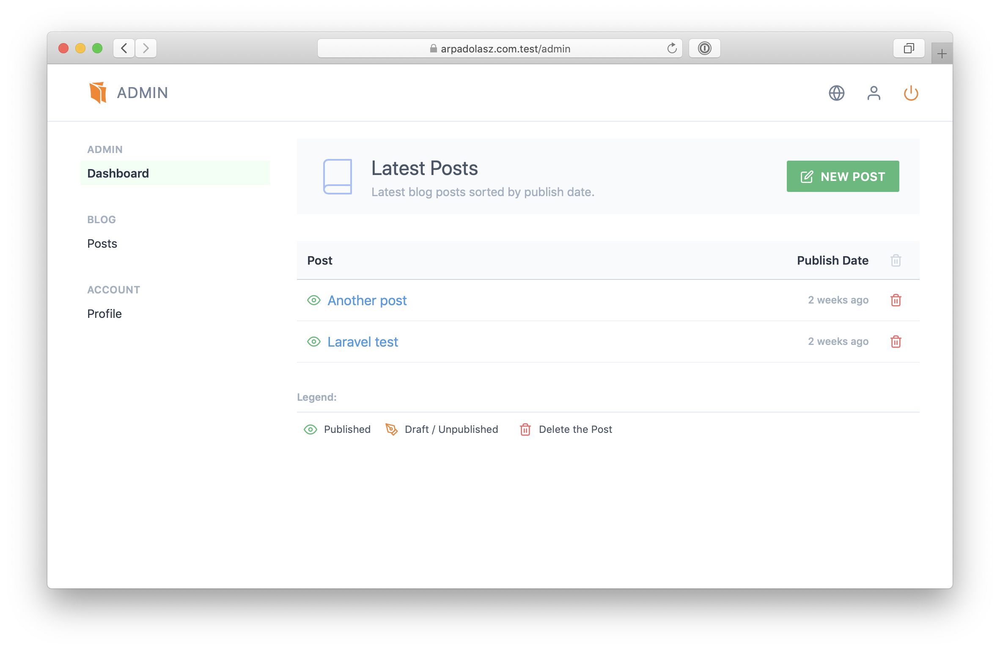

# Introduction

The package `wingsline/laravel-blog` was inspired by the source code of [freek.dev](https://freek.dev) website, available on [GitHub](https://github.com/spatie/freek.dev).

I needed a more customizable blog with similar (and some extra) features,
but as a [Laravel](https://laravel.com) package, so I've written this package from scratch.

## Features

Some of the most notable features are:

- Laravel Artisan Installer
- Automatic image uploads
- RSS feed
- Backup
- Theme
- Proper display of high dpi images in posts

## Security

If you discover any security related issues, please email [wingsline@gmail.com](mailto:wingsline@gmail.com) instead of using the issue tracker.
