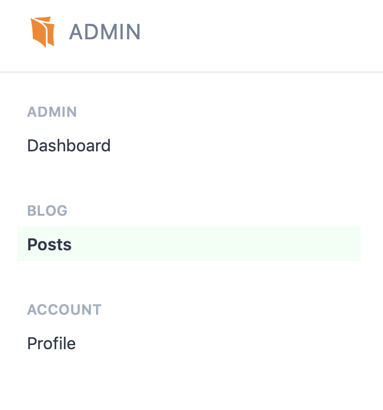
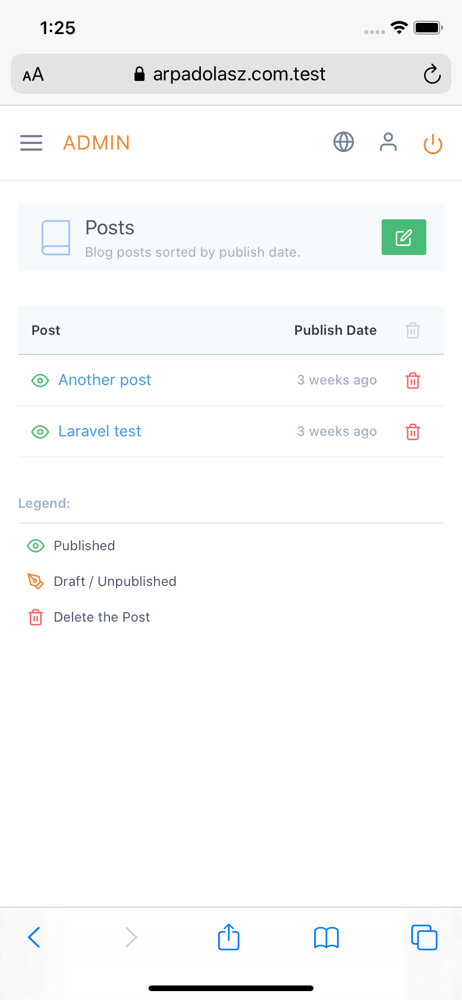

# Getting Started

You can access the admin interface by visiting `/admin`, which can be changed by editing the `config/blog.php` or adding the following key to your `.env` file:

```php
ADMIN_PREFIX="foo-admin"
```

Now the admin will be available at `https://example.com/foo-admin`.

The default username is `admin@example.com` and the password is `admin123`. You **need** to change this after the blog was installed in the [Profile](/guide/admin/account-profile.html) page.

**Note:** Since this blog package was written for a single user, currently all users have access to edit the blog. This may change in the future.


On the top right corner there are three icons:


* Visit the web site
* Edit your profile
* Sign out

On the left you can find the main navigation of the admin interface, where you can list, create or edit the posts. You can also access your profile:



This menu is hidden if you are visiting the admin interface from a small screen. You can toggle the menu from the top left corner:

