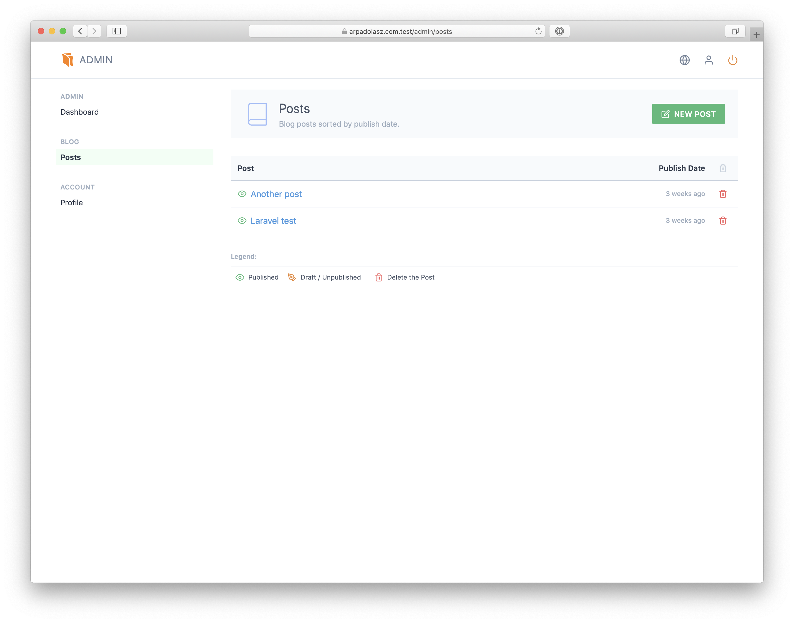
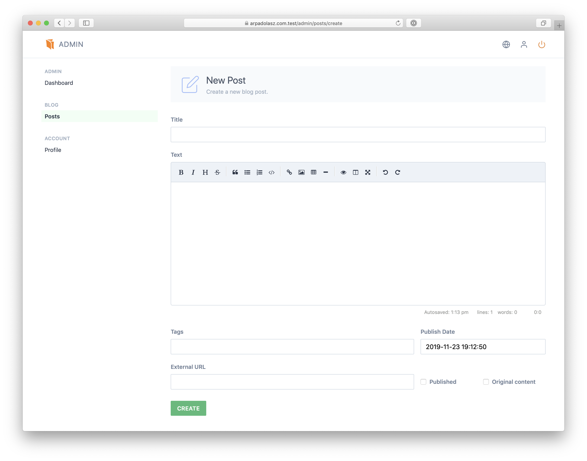
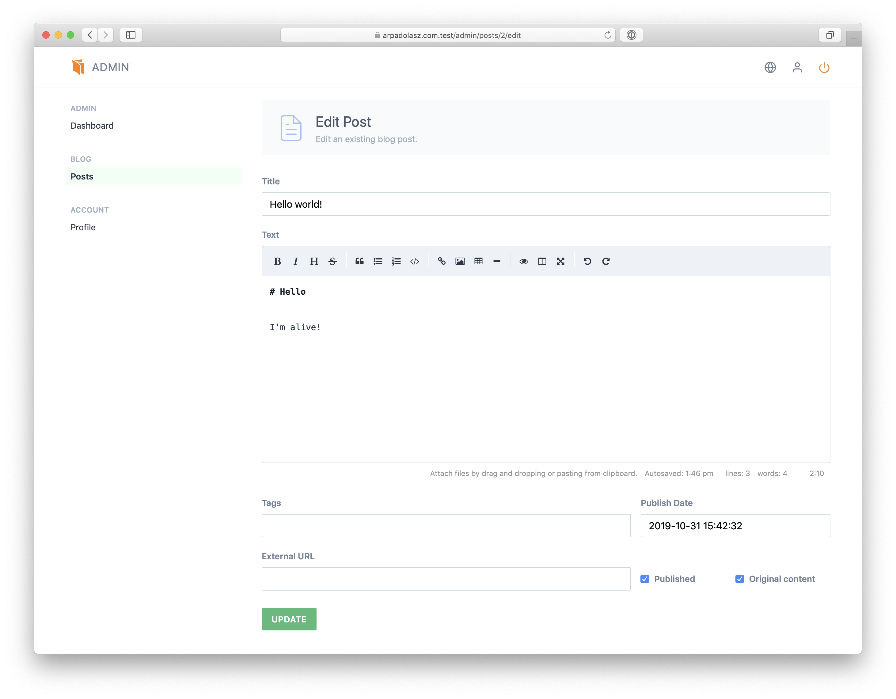

# Posts

You can see the current blog posts by visiting the Posts page.

Clicking the posts’ name will **edit** the selected post.

You can also **delete** the post by clicking on the trash icon on the right.

## Creating a Post

Clicking on the “New Post” will allow you to create a new blog post:

* **Title** — Title of the post.
* **Text** — Content of the post. Uploading images are not available when **creating** a new post. After it was saved you can upload images by drag & drop or selecting the “Insert Image” from the editor toolbar.
* **Tags** — (optional) comma separated tags
* **External URL** — (optional) if an URL is provided, the blog post title will point to that url.
* **Publish Date** — when the blog post will be published. You can even set a past or future date. Setting this date in the future and marking the blog as published, allows you to write a blog post that will appear **only** after the published date.
* **Published** — when checked the blog post will be available on the site.
* **Original Content** — checking it will prefix the blog post title with a “★”.

---

Posts content is auto-saved in the browser’s local storage. In case of a browser crash, lost internet connection, opening the post in the same browser can restore the post.

## Editing a Post

Clicking on the post’s title will allow you to edit an existing post:

* **Title** — Title of the post.
* **Text** — Content of the post. You can upload images by drag & drop or selecting the “Insert Image” from the editor toolbar.
* **Tags** — (optional) comma separated tags
* **External URL** — (optional) if an URL is provided, the blog post title will point to that url.
* **Publish Date** — when the blog post will be published. You can even set a past or future date. Setting this date in the future and marking the blog as published, allows you to write a blog post that will appear **only** after the published date.
* **Published** — when checked the blog post will be available on the site.
* **Original Content** — checking it will prefix the blog post title with a “★”.

---

Posts content is auto-saved in the browser’s local storage. In case of a browser crash, lost internet connection, opening the post in the same browser can restore the post.